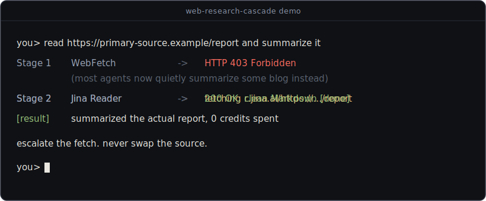

# web-research-cascade

**A Claude Code / agent skill that stops your agent from silently reading the wrong source.**



The skill enforces two habits, in that order. First, before fetching anything, the agent decides which sources would genuinely best answer the question: the primary document, the official docs, the actual announcement, not whichever page is easiest to fetch. Second, once a source is chosen, the agent actually gets it. Today, when an agent hits a `403`, it usually does not tell you; it quietly summarizes a secondary blog that *quotes* the source, and your analysis ends up built on second-hand material you never chose. This skill turns that silent fallback into a visible escalation: the *same* URL is worked through stronger fetch methods until the real page comes through.

```text
You: "Read https://some-primary-source.com/report and summarize it."

Without the cascade
  WebFetch  ->  403 Forbidden
  Agent silently summarizes a blog that quotes the report.
  You never learn the primary source was skipped.

With web-research-cascade
  Stage 1  WebFetch      ->  403 Forbidden
  Stage 2  Jina Reader   ->  full report, clean Markdown   [done]
  Agent summarizes the actual source.
```

> Source quality beats fetch convenience. A good blocked source is opened via the cascade, never swapped for a weaker error-free one: a 403 is a transport problem, not a reason to drop the source.

## The cascade

Per URL, escalate only when the current stage is blocked:

| Stage | Method | Beats | Cost |
|------:|--------|-------|------|
| 1 | **WebFetch** direct | nothing; the fast default | free |
| 2 | **Jina Reader** (`r.jina.ai`) | datacenter-IP blocks, JS-heavy pages | free, keyless |
| 3 | **Firecrawl** script (sparingly) | hard Cloudflare/bot walls (no login) | ~1000 free/mo |
| 4 | **Browser** (Chrome MCP) | real login, CAPTCHA, paywalls, your account | your session |

Plus dedicated shortcuts for sources that block the generic path: **Reddit** (`.json` route via your logged-in browser), **single X/Twitter tweets** (unofficial no-auth syndication endpoint, bundled `x_tweet.py`), and **Zendesk** help centers (their article JSON API).

## Stage 4 needs your own browser

Stages 1 to 3 are plain HTTP fetches. Stage 4 is different: it needs a browser MCP that can see your real, logged-in browser session, such as Claude in Chrome or Playwright attached to your own Chrome profile over CDP. That session is what makes login-walled sources like Reddit and X readable at all. The agent opens the page through your account and sees exactly what you would see in your own browser: no scraping farm, no borrowed credentials, just your own view of the web.

Treat that power with care: use it only on your own accounts and sessions, never point it at pages that display secrets (API-key pages, token settings) because page content can end up in the conversation transcript, and remember that your account stays bound by each site's terms of service. See the [Disclaimer](#disclaimer).

## Quickstart (under 5 minutes)

**1. Install the skill.** Copy this folder into your skills directory:

```bash
git clone --depth=1 https://github.com/belschak/web-research-cascade.git \
  ~/.claude/skills/web-research-cascade
```

(Cloning straight into the skills folder keeps `git pull` working for updates. On Windows, run this in Git Bash or PowerShell.)

That is it. The skill auto-triggers on research and on any blocked fetch. Stages 1 and 2 need no keys or setup; stage 4 uses whatever browser MCP your agent already has (if any).

**2. (Optional) Enable stage 3.** Firecrawl is only for the rare page that beats Jina. To turn it on, get a free key at [firecrawl.dev](https://firecrawl.dev), then:

```bash
cd ~/.claude/skills/web-research-cascade
cp .env.example .env
# then open .env and paste your key after the "=" sign
```

Both bundled scripts are **standard-library Python only** (no `pip install`), cross-platform, and never print your key.

## When it triggers

Any fetch that returns `403 / 401 / 429`, "unable to fetch", an empty or truncated body, or a CAPTCHA / "log in to continue" page. Also on any research where primary sources matter, and on prompts like "read this page", "what does X say", "research Y".

## Why Firecrawl is a script, not an MCP

The Firecrawl MCP server injects an instruction that makes `firecrawl_search` the primary search tool, which overrides this cascade (quoted verbatim in [`src/index.ts`](https://github.com/firecrawl/firecrawl-mcp-server/blob/3eb1115b1f2883ff2fb74e61b5c4acf5a9ac0fb0/src/index.ts#L387), as of 2026-07). Claude Code currently offers no configuration to suppress what an MCP server injects; related requests were closed *not planned*: [claude-code#43690](https://github.com/anthropics/claude-code/issues/43690) (suppressing built-in MCP tool injection) and [claude-code#30545](https://github.com/anthropics/claude-code/issues/30545) (MCP server instructions overriding CLAUDE.md rules). The script has no such instruction, costs no standing context, and stays scrape-only (1 credit).

## Contributing

Issues and PRs welcome. Good first contributions: a new "source with its own route" (like the Reddit/X/Zendesk shortcuts), a fix for a stage that broke because a provider changed, or a tested improvement to `x_tweet.py`. Open an issue describing the blocked source and how you got through. Details in [CONTRIBUTING.md](CONTRIBUTING.md); issues labeled `good first issue` are scoped to under an hour.

## Related skills

- **repo-audit**: audit a third-party repo, package, or skill for security red flags before you install it. Next repo in this series; this line becomes a link when it ships.

## Disclaimer

This project is not affiliated with, endorsed by, or sponsored by X Corp.,
Reddit, Jina AI, Firecrawl, or Anthropic. `x_tweet.py` uses an unofficial,
publicly reachable endpoint (the same one X uses to render public embeds);
it may stop working at any time. All scripts and documented routes are
intended for personal research on public content. You are responsible for
complying with the terms of service of any site or API you access and with
applicable law. Use at your own risk; see [LICENSE](LICENSE) for the
warranty disclaimer.

## License

MIT. See [LICENSE](LICENSE).
